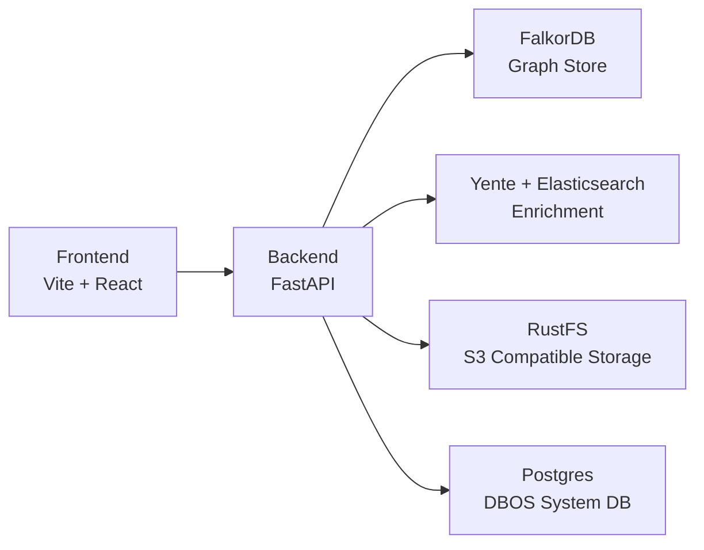

# Architecture

## High-level view

OSINT Master is split into a React frontend, a FastAPI backend, and infrastructure services for graph storage, search, and object storage.

## Service boundaries

- **Frontend**: investigation UX, graph and map visualization, auth bridge, notebook canvas.
- **Backend**: API routes for investigations, entities, ingest, graph views, schema, enrich, chat, and auth context.
- **FalkorDB**: source of truth for entity and relation graph per investigation.
- **Yente stack**: external index and enrichment lookup support.
- **RustFS**: stores extracted and uploaded artifacts through S3-compatible APIs.
- **Postgres**: DBOS runtime state and workflow metadata.

## Data flow (ingestion)

1. Analyst uploads FTM/JSON payload for an investigation.
2. Backend parses and normalizes records into graph primitives.
3. Graph entities and links are persisted to FalkorDB.
4. Frontend fetches nodes/edges and renders interactive views.

## Data flow (analysis)

1. Analyst expands an entity from graph or map view.
2. Backend resolves neighbors and related metadata.
3. Optional enrichment calls fan out to Yente-backed endpoints.
4. Notes and investigation context are stored via notebook endpoints.
